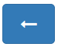
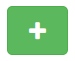
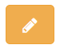
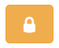
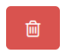

(sample-tracker)=
# Sample Tracking

This section describes how to use the Sample Tracker to manage samples including:

* [Creating and managing samples](sample-tracker-create)
* [Adding events to a sample](sample-tracker-events)

## Introduction

The Sample Tracker system available at the HTMDEC DMS can be used to track
samples from the time they are manufactured to the time they are analyzed. 

After [signing in](signing-in) to your account, select the "Sample Tracker" tab
from the left-hand menu to view the Sample Tracker dashboard:

```{figure} images/htmdec-sample-tracker-dashboard.png
---
name: dms-sample-tracker-dashboard
---
```

(sample-tracker-create)=
## Creating and managing samples

Select an 'Add a new sample' button (green button with a white plus at top right corner)
to create a new sample:

```{figure} images/htmdec-sample-tracker-add-sample.png
---
name: dms-sample-tracker-add-sample
---
```

This will open a form where you can enter the sample details:

```{figure} images/htmdec-sample-tracker-add-sample-form-blank.png
---
name: dms-sample-tracker-add-sample-form-blank
---
```

Fill in the form with the sample details (a *name* for the sample is mandatory) and click the
'Save' button to create the sample. Click the 'Close' button, or click outside
the form, to discard the form. 

```{figure} images/htmdec-sample-tracker-add-sample-form.png
---
name: dms-sample-tracker-add-sample-form
---
```

After saving the sample, you will be redirected
to the Sample details page where you can see the sample's unique QR code:

```{figure} images/htmdec-sample-tracker-sample-details-fresh.png
---
name: dms-sample-tracker-sample-details-fresh
---
```

You can right-click on the QR code to save it and print it as you would any standard image.
The sample details page also shows the sample's details and history of events. There are multiple actions you can perform on the sample details page:

*  **Back**: Click the 'Back' button (left arrow on a blue button) to go back to the Sample Tracker dashboard.
*  **Add**: Click the 'Add an event' button to add an event to the sample.
*  **Edit**: Click the 'Edit' button to edit the sample name, description and event types.
  This opens the same form as the one used to create the sample, but with the sample details filled in.
*  **Access**: Click the 'Access Control' button to control who has access to the sample and who can add events. There are three access levels: 1) Can view, 2) Can write, and 3) Is owner. *Can view* access level grants a read-only view to events list, *Can write* allows to add new events, whereas *Is owner* allows to delete the sample and change access levels. You can add users or groups by typing their name in the 'Grant access...' field and selecting the access level from the dropdown list. Click the 'Save' button to save the changes. Click the 'Close' button, or click outside the form, to discard the form.
*  **Delete**: Click the 'Delete' button to delete the sample. **This action is irreversible.**

(sample-tracker-events)=
## Adding events to a sample

If you click the 'Add an event' button, or follow the QR code, on the sample details page, you will be taken to the 'Add an event' form:

```{figure} images/htmdec-sample-tracker-add-event-form.png
---
name: dms-sample-tracker-add-event-form
---
```

Your web browser may ask for permission to share your location. This is used to record the location (latitude and longitude) of the event. Click 'Allow' to share your location, or 'Block' to not share your location. If you block sharing your location, the location will be recorded as 'Unknown'. Fill in the form with the event details. Event type is mandatory. If the sample has a predefined set of event types, the event type field will be a dropdown list. Otherwise, you can type in the event type. Click the 'Close' button, or click outside the form, to discard the form. Click the 'Save' button to add the event to the sample. After saving the event, you will be redirected to the sample details page where you can see the event in the history of events:

```{figure} images/htmdec-sample-tracker-sample-details-event.png
---
name: dms-sample-tracker-sample-details-event
---
```

## Managing multiple samples at once

You can select multiple samples from the Sample Tracker dashboard by clicking the checkboxes next to each sample. Once you have selected one or more samples, you can perform bulk actions using the "Samples Actions" dropdown menu that is located above the samples list.

```{figure} images/htmdec-sample-tracker-bulk-actions.png
---
name: dms-sample-tracker-bulk-actions
alt: "Screenshot of bulk actions dropdown"
```

The available bulk actions include:

```{figure} images/htmdec-sample-tracker-bulk-actions-menu.png
---
name: dms-sample-tracker-bulk-actions-menu
alt: "Screenshot showing the dropdown menu with bulk action options for samples"
---
```
